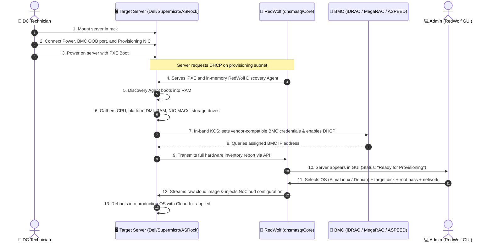

<p align="center">
  
</p>

<p align="center">
  <strong>Modern, open-source automated provisioning platform for Bare Metal servers (Dell, Supermicro, ASRock Rack) and Virtual Machines</strong>
</p>

<p align="center">
  
  <a href="https://hub.docker.com/r/wolverandover/redwolf"></a>
  
  
  
  
</p>

---

## 🐺 About RedWolf

**RedWolf** is an open-source bare-metal and virtual machine automation system built for data center infrastructure engineers, sysadmins, and DevOps teams. Its purpose is to streamline server installation, turning bare hardware racking into a zero-touch, hands-off provisioning process.

RedWolf features a built-in **Hardware Abstraction Layer (HAL)** supporting major enterprise hardware platforms:
* **Dell PowerEdge:** 13th, 14th, 15th, and 16th Gen (R640, R740, R750 with iDRAC 8/9).
* **Supermicro:** Intel and AMD platforms (X10, X11, X12, H11, H12 with AMI MegaRAC BMC).
* **ASRock Rack:** Server motherboards (EPYCD8, ROMED8, B650D4 series with ASPEED AST2500/2600 BMC).
* **Virtualization & Generic x86_64:** Standard IPMI 2.0 / Redfish servers and VMs (KVM, Proxmox, VMware ESXi).

---

## ⚡ Technician Deployment Workflow

Traditional provisioning requires connecting local crash carts/monitors, manually configuring BIOS and BMC settings, flashing USB media, or manually assigning static IPs. **RedWolf eliminates all manual setup:**



---

## 📖 Step-by-Step Operator Guide

Follow these steps to deploy the RedWolf appliance and provision bare-metal servers or virtual machines from scratch.

### Step 1: Deploy the RedWolf Appliance

RedWolf is published as an official, pre-built production container on Docker Hub ([`wolverandover/redwolf`](https://hub.docker.com/r/wolverandover/redwolf)). RedWolf requires `network_mode: host` (or Macvlan) to observe Layer-2 DHCP discovery broadcasts on the provisioning interface.

#### Method A: Docker Compose (Recommended)
```bash
# 1. Clone the repository
git clone https://github.com/TensorDriftStudio/RedWolf.git
cd RedWolf

# 2. Pull the official image and start the appliance container
docker compose pull
docker compose up -d

# 3. Check service health and verify logs
docker compose ps
curl -s http://localhost:8080/healthz
curl -s http://localhost:8080/api/version
```

#### Method B: Standalone Docker Run
To run the pre-built image directly without cloning the repository:
```bash
# Pull the latest official appliance image
docker pull wolverandover/redwolf:latest

# Create host persistent data directories
mkdir -p data/db data/images data/tftp

# Launch container with host networking & required network capabilities
docker run -d \
  --name redwolf-core \
  --restart unless-stopped \
  --network host \
  --cap-add NET_ADMIN \
  --cap-add NET_BIND_SERVICE \
  --cap-add NET_RAW \
  -e REDWOLF_HTTP_PORT=8080 \
  -e REDWOLF_PROVISIONING_INTERFACE=eth0 \
  -e REDWOLF_DB_PATH=/var/lib/redwolf/db/redwolf.db \
  -e REDWOLF_IMAGE_DIR=/var/lib/redwolf/images \
  -e REDWOLF_TFTP_DIR=/var/lib/redwolf/tftp \
  -v $(pwd)/data/db:/var/lib/redwolf/db \
  -v $(pwd)/data/images:/var/lib/redwolf/images \
  -v $(pwd)/data/tftp:/var/lib/redwolf/tftp \
  wolverandover/redwolf:latest
```

> [!NOTE]
> For installations where the provisioning network is isolated on a dedicated physical interface (e.g. `eth1`), use the Macvlan compose profile:
> `docker compose -f docker-compose.macvlan.yml up -d`
> 
> For active frontend UI development with instant Hot Module Replacement (HMR) inside Docker:
> `docker compose -f docker-compose.dev.yml up --build` (Web UI live at `http://localhost:5173`)

---

### Step 2: Access the RedWolf GUI

Open your browser and navigate to:
```text
http://<APPLIANCE_IP>:8080
```

1. **Authentication:** Choose your authentication provider on the login screen:
   - **Local Admin:** Built-in appliance administrator credentials.
   - **OpenLDAP / FreeIPA:** Authenticates against corporate RFC 4511 directories.
   - **Active Directory:** Authenticates against Windows AD DS using LDAPS (port 636).
2. Click **Sign In to RedWolf GUI** to enter the Fleet Management dashboard.

---

### Step 3: Configure Network & OS Image Catalog

Before booting servers, configure your subnet parameters and download target operating systems:

1. **Open Settings:** Click the **Settings** icon in the top navigation bar.
2. **PXE Engine & Network:**
   - Under the **PXE Engine & Network** tab, verify or update the Subnet CIDR (e.g. `192.168.0.0/24`), DHCP Range (`192.168.0.100` - `192.168.0.200`), and Gateway.
   - Click **Save Configuration**. The internal `dnsmasq` service reloads dynamically without dropping connections.
3. **Distribution Mirror & OS Images:**
   - Navigate to the **Distribution Mirror & Cache** tab.
   - Click **Download Image** next to **AlmaLinux 9** or **Debian 12**.
   - RedWolf downloads official cloud raw images asynchronously and verifies checksums. Live progress is displayed directly in the GUI.
   *(Alternatively, run `bash scripts/download-images.sh --os almalinux9` via CLI).*

---

### Step 4: Hardware Racking & Zero-Touch Discovery

1. **Physical Connections:**
   - Connect **Power** to the server power supplies.
   - Connect the server's **Dedicated BMC RJ-45 Port** to your management network.
   - Connect the primary **Provisioning NIC (NIC 1)** to the RedWolf provisioning subnet.
2. **Power On:** Power on the node. Ensure UEFI/BIOS boot priority has **Network (PXE)** enabled.
3. **Automated Discovery Process:**
   - RedWolf DHCP responds with the iPXE bootloader (`ipxe.efi`).
   - The node boots the Alpine-based `redwolf-discovery` agent entirely in RAM.
   - The agent reads chassis DMI (Dell Service Tag, Supermicro / ASRock serial), enumerates all CPUs, DIMMs, network cards, and disks (NVMe, SAS, SATA, BOSS, SATADOM).
   - In-band KCS (`/dev/ipmi0`) configures BMC Dedicated port mode, enables DHCP, and escrows credentials into RedWolf's encrypted AES-256-GCM vault.
4. **Appears in Fleet Dashboard:**
   - Within 60–90 seconds, the node transitions to **"Ready for Provisioning"** in the RedWolf GUI.

---

### Step 5: Provision the Operating System

1. In the RedWolf GUI Fleet view, click **Provision OS** on the discovered node.
2. **Step 1 - Operating System:** Select target OS (e.g., *AlmaLinux 9* or *Debian 12*).
3. **Step 2 - Target Drive Selection:**
   - Select the target storage disk from the detected hardware list (e.g. `Dell BOSS RAID1`, `Samsung PM9A3 NVMe`, or SAS drive).
   - Devices are referenced by immutable identifiers (`/dev/disk/by-id/...`), preventing accidental drive overwrites.
4. **Step 3 - Cloud-Init & Credentials:**
   - Specify hostname, admin username, root password, and optional SSH authorized keys.
   - Select network configuration: **DHCP** or **Static IP** (automatically bound to the detected network card MAC address).
5. **Step 4 - Deploy:**
   - Review configuration and click **Start Deployment**.
   - RedWolf streams the raw compressed image, automatically fixes the secondary GPT boundary (`sgdisk -e`), mounts root in RAM, and injects NoCloud Cloud-Init configuration (`user-data`, `meta-data`, and MAC-matched `network-config`).
   - The node reboots directly into the production OS.

---

### Step 6: Post-Deployment Management & Lifecycle Actions

From the RedWolf GUI, select any node to open the **Hardware Telemetry & Control Drawer**:

* **BMC Management & Console:**
  - View the discovered BMC IP address. Click **Open Console** to launch the vendor's web interface (iDRAC / MegaRAC / ASPEED).
  - Reveal or rotate escrowed BMC passwords on demand.
  - Execute remote chassis power commands (**Power On**, **Power Off**, **Power Cycle** via IPMI/Redfish).
* **Reset Node State:**
  - Click **Reset State** to clear a stuck deployment or re-trigger discovery.
* **Decommission Node:**
  - Click **Decommission** to remove obsolete or replaced hardware from inventory.

---

### Step 7: Testing Without Physical Hardware (Node Simulator)

You can simulate bare-metal nodes and test the complete workflow without physical servers:

```bash
# Simulate a Dell PowerEdge R640 node sending live telemetry
bash scripts/simulate-node.sh --vendor dell --count 1

# Simulate a Supermicro or ASRock Rack server
bash scripts/simulate-node.sh --vendor supermicro --count 1
bash scripts/simulate-node.sh --vendor asrock --count 1

# Launch an actual QEMU VM booting the real discovery kernel & initramfs
bash scripts/simulate-node.sh --mode qemu --vendor dell
```

---

## 🐳 Docker Deployment Details

Official pre-built production appliance images are published to Docker Hub:
* **Repository:** [`wolverandover/redwolf`](https://hub.docker.com/r/wolverandover/redwolf)
* **Tags:**
  * `wolverandover/redwolf:latest` — Tracks the latest stable release
  * `wolverandover/redwolf:1.2.0` — Immutable release version

The production appliance container packages all dependencies into a lightweight, secure Alpine image:

```bash
# Pull official image from Docker Hub
docker pull wolverandover/redwolf:latest

# Start the appliance using Docker Compose
docker compose up -d

# View live container logs
docker compose logs -f redwolf
```

### Environment Variables

| Variable | Default | Description |
| :--- | :--- | :--- |
| `REDWOLF_HTTP_PORT` | `8080` | Port for Web GUI and REST API |
| `REDWOLF_PROVISIONING_INTERFACE` | `eth0` | Network interface for DHCP/TFTP broadcasts |
| `REDWOLF_DB_PATH` | `/var/lib/redwolf/db/redwolf.db` | Path to persistent SQLite WAL database |
| `REDWOLF_IMAGE_DIR` | `/var/lib/redwolf/images` | Storage cache directory for OS images |
| `REDWOLF_TFTP_DIR` | `/var/lib/redwolf/tftp` | TFTP root serving iPXE bootloaders |

---

## 🛠️ Tooling & Scripts Reference

### 1. Build Discovery Boot Assets (Kernel & Initramfs)
To build or update the Alpine Linux in-memory discovery environment:
```bash
bash scripts/build-discovery-ramfs.sh
```
Outputs `assets/discovery/vmlinuz` and `assets/discovery/initramfs.img` with bundled hardware drivers (`ixgbe`, `i40e`, `bnxt_en`, `tg3`, `mlx5_core`, `megaraid_sas`, `mpt3sas`, `smartpqi`, `nvme`), GNU `util-linux`, `ipmitool`, and the static Go `redwolf-discovery` binary.

### 2. Cloud OS Image Manager
To inspect, download, or verify OS distributions via CLI:
```bash
# Check download cache status
bash scripts/download-images.sh --check

# Download specific distribution
bash scripts/download-images.sh --os almalinux9
bash scripts/download-images.sh --os debian12

# Download all supported distributions
bash scripts/download-images.sh --all
```

---

## 📁 Repository Layout

```text
RedWolf/
├── AGENTS.md                  # Mandatory AI context & engineering guidelines (English only)
├── README.md                  # Main project documentation (this file)
├── CHANGELOG.md               # Keep a Changelog semantic release history
├── VERSION                    # SemVer release tag (1.2.0)
├── Dockerfile                 # Multi-stage production container build (Web UI + Go Core + Assets)
├── docker-compose.yml         # Host-networking appliance deployment
├── docker-compose.macvlan.yml # Isolated physical interface Macvlan deployment
├── docker-compose.dev.yml     # Live frontend development environment with Vite HMR
├── cmd/
│   ├── redwolf/               # RedWolf Core server daemon entrypoint
│   └── redwolf-discovery/     # In-memory bare-metal discovery agent entrypoint
├── internal/
│   ├── domain/                # Pure domain models (ServerNode, Hardware, Credentials, FSM)
│   ├── service/               # Orchestration services (Provisioner, Auth, Settings, BMC Escrow, ImageCatalog)
│   ├── adapter/               # Infrastructure adapters (HTTP/Chi, SQLite WAL, dnsmasq, LDAP/AD, AES-256)
│   ├── agent/                 # Discovery agent collectors (CPU, DMI, Memory, Network, Storage, BMC)
│   └── version/               # Enterprise version and build metadata
├── scripts/
│   ├── build-discovery-ramfs.sh # Automated Alpine discovery kernel & ramdisk packager
│   ├── init.sh                # In-memory discovery system init (PID 1) script
│   ├── simulate-node.sh       # Multi-vendor hardware simulator & QEMU test rig
│   ├── download-images.sh     # Cloud raw image mirror and verification utility
│   └── Dockerfile.discovery   # Clean containerized build environment for PXE boot artifacts
├── assets/
│   ├── discovery/             # Network bootable vmlinuz kernel & initramfs
│   ├── tftp/                  # Production iPXE bootloaders (ipxe.efi, undionly.kpxe)
│   └── logo/                  # Vector SVG and high-resolution PNG brand assets
├── web/                       # React 19 + TypeScript + Vite + TailwindCSS Enterprise Dashboard
└── docs/                      # Architectural specifications and operational guides
```

---

## 🎨 Visual Assets & Branding

Lossless vector SVGs and transparent PNGs are available in [`assets/logo/`](file:///home/dawid/RedWolf/assets/logo/):
* **Horizontal Dark Logo:** [`assets/logo/redwolf-horizontal-dark.svg`](file:///home/dawid/RedWolf/assets/logo/redwolf-horizontal-dark.svg) (for Web GUI navbar).
* **Icon / Emblem:** [`assets/logo/redwolf-icon.svg`](file:///home/dawid/RedWolf/assets/logo/redwolf-icon.svg) (favicon, avatars, collapsed sidebar).
* **Interactive Showcase:** View [`assets/logo/index.html`](file:///home/dawid/RedWolf/assets/logo/index.html).

---

## 🚀 Roadmap

### ✅ Version 1.0.0 — Baseline MVP (Completed)
- [x] Initial multi-vendor HAL architecture for Dell PowerEdge, Supermicro, and ASRock Rack.
- [x] In-memory Alpine Linux discovery agent (`redwolf-discovery`) with kernel drivers.
- [x] iPXE/TFTP bootloader chaining with dynamic `/boot.ipxe` script generation.
- [x] SQLite WAL database storage engine with concurrency protection.
- [x] Core React 19 + TypeScript + TailwindCSS operator console.
- [x] Multi-directory identity provider support (Local Admin, OpenLDAP, Active Directory).
- [x] Hardware telemetry ingestion for CPUs, memory DIMMs, network interfaces, and storage drives.

### ✅ Version 1.2.0 — Enterprise Storage & Platform Release (Current)
- [x] **Full LVM Provisioning Engine:** Complete LVM Volume Group (`vg_system`) and Logical Volume allocation engine with dynamic disk-capacity auto-fit in the Web UI.
- [x] **Cross-Vendor Software RAID (`mdadm`):** Automated RAID 0, 1, 5, 10 array creation for AlmaLinux and Debian with dual `mdadm.conf` sync and redundant EFI bootloader replication.
- [x] **Dynamic Partition Auto-Expansion:** Deterministic GPT root partition boundary repair (`parted resizepart`, `partprobe`) with online filesystem growth (`xfs_growfs` / `resize2fs`).
- [x] **Modern LTS OS Catalog:** Added official **AlmaLinux 10** and **Debian 13 LTS** cloud raw images with direct automated download pipelines.
- [x] **Enterprise Discovery Asset Pipeline:** Prebuilt Alpine discovery RAMdisk release workflow (`initramfs.img`, `vmlinuz`) with automatic entrypoint download fallback.

### ✅ Version 1.1.0 — Enterprise Release
- [x] **Enterprise Semantic Versioning (SemVer):** Added `internal/version`, `GET /api/version` endpoint, Docker `-ldflags` injection, `VERSION`, and `CHANGELOG.md`.
- [x] **Branding & UI Standardization:** Unified application as **RedWolf GUI** with official vector logo and removed all temporary placeholder icons.
- [x] **Production Security Hardening:** Eliminated default credential hints and quick-fills from the login interface; added `ipmitool` package to production container.
- [x] **Dynamic Subnet & DNS Engine:** Integrated dynamic `dhcp-range`, `dhcp-boot`, and DNS option management in `dnsmasq` adapter with live subprocess reload on configuration changes.
- [x] **Automated OS Image Management:** Background cloud raw image downloader (`internal/service/image_catalog.go`) with live progress tracking in the Settings UI.
- [x] **Fleet Node Lifecycle Management:** Interactive node state reset (`POST /api/nodes/{id}/reset`) and decommission (`DELETE /api/nodes/{id}`).

### ⏳ Version 1.3.0 — Hardware Management & Observability (Next)
- [ ] **Redfish Out-of-Band Firmware Management:** Automated BIOS, iDRAC, and BMC firmware updates via DMTF Redfish API.
- [ ] **RAID Controller In-Band Configuration:** Automated hardware virtual disk array creation (RAID 0, 1, 5, 10) on Broadcom/LSI MegaRAID, Dell PERC, and Microsemi SmartRAID controllers via `storcli` / `perccli`.
- [ ] **Hardware Pre-Provisioning Stress Testing:** Automated RAM, CPU, and NVMe SMART endurance burn-in tests (`memtester`, `stress-ng`, `nvme-cli`) before marking nodes "Ready for Provisioning".
- [ ] **Remote OS Image Storage (S3 / MinIO):** Direct streaming of cloud images from enterprise object storage.
- [ ] **Role-Based Access Control (RBAC):** Granular permission scopes (Auditor, Operator, Infrastructure Admin) with audit logs.

### 🔮 Version 2.0.0 — Distributed Infrastructure (Long-Term)
- [ ] **Multi-Rack / Multi-Datacenter Relay Agents:** Lightweight Layer-2 proxy daemons for distributed provisioning across multiple enterprise racks and edge sites.
- [ ] **Terraform & OpenTofu Provider:** Infrastructure-as-Code provider to define and provision bare-metal nodes natively in Terraform.
- [ ] **High-Availability (HA) Core Clustering:** Raft-based consensus clustering for RedWolf Core appliances with active-passive DHCP failover.

---

## 📄 License

RedWolf is developed as open-source software under the Apache 2.0 / GPLv3 licenses.
