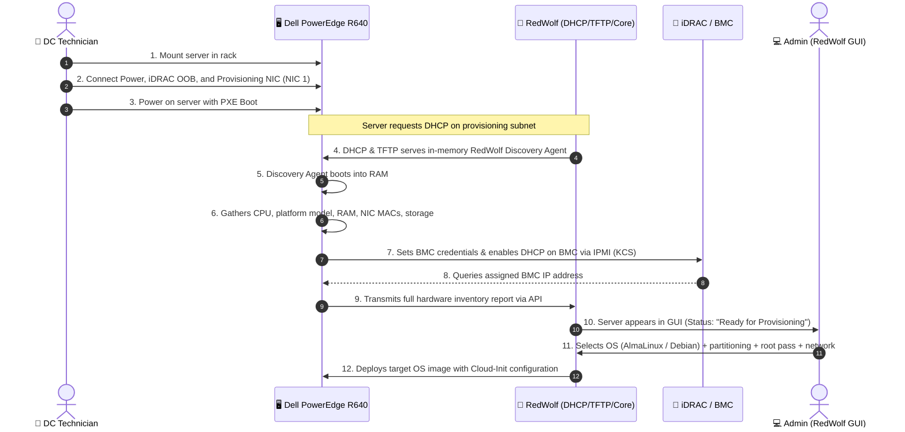

<p align="center">
  
</p>

<p align="center">
  <strong>Modern, open-source automated provisioning platform for Bare Metal servers and Virtual Machines</strong>
</p>

<p align="center">
  
  
  
  
</p>

---

## 🐺 About RedWolf

**RedWolf** is an open-source bare-metal and virtual machine automation system built for data center infrastructure engineers, sysadmins, and DevOps teams. Its purpose is to streamline server installation, turning bare hardware racking into a zero-touch, hands-off provisioning process.

The primary reference hardware platform for initial development is the **Dell PowerEdge R640**, while maintaining broad support for generic x86_64 server platforms and virtualized environments (KVM, Proxmox, VMware).

---

## ⚡ Technician Deployment Workflow

Traditional provisioning requires connecting local monitors/keyboards, manually configuring BIOS and iDRAC settings, flashing USB media, or manually assigning static IPs. **RedWolf eliminates all manual setup:**



### Step-by-Step Breakdown:

1. **Physical Server Mounting:**
   The technician mounts the server (e.g. Dell PowerEdge R640) into the server rack and connects exactly 3 cables:
   - **a) Power:** Redundant Power Supplies (PSU1 / PSU2)
   - **b) iDRAC / BMC:** Dedicated Out-of-band (OOB) management RJ-45 port
   - **c) Provisioning Network:** First physical network port (NIC 1 / eth0 / onboard 1GbE/10GbE LOM)

2. **PXE Boot:**
   The technician powers on the server. The node boots via PXE network boot.

3. **Autonomous Takeover by RedWolf (Auto-Discovery):**
   - RedWolf controls integrated **DHCP** and **TFTP/HTTP** services on the isolated provisioning network.
   - Upon network boot, the server loads a lightweight in-memory micro-OS (**RedWolf Discovery Agent**).
   - The agent automatically executes without human intervention:
     - **Hardware Inventory Discovery:**
       - CPU model, architecture, sockets, physical cores, and logical threads
       - Platform & chassis model (e.g. `Dell Inc. PowerEdge R640`) and Service Tag
       - Total RAM capacity, speed, and DIMM slot population
       - MAC addresses, link speeds, and PCI topology of all network interfaces
       - Attached storage drives (NVMe, SSD, HDD, BOSS controllers)
     - **BMC / iDRAC Automation:**
       - Configures a secure, pre-defined administrator username and password
       - Switches BMC network interface into DHCP mode
       - Queries and records the dynamically assigned BMC IP address

4. **Real-time RedWolf GUI Dashboard:**
   - All collected telemetry is sent back to the RedWolf Core API.
   - The node is displayed in the Web GUI with the status **"Ready for Provisioning"**.

5. **Cloud-Init OS Deployment:**
   From the RedWolf graphical interface, the administrator selects the desired OS and parameters:
   - **Supported Distributions:**
     - **AlmaLinux:** versions `8`, `9`, `10`
     - **Debian:** versions `12 (Bookworm)`, `13 (Trixie)`
   - **Deployment Settings:**
     - **Storage & Partitioning:** Automated disk layout (LVM, software RAID 1/5/10, SSD/NVMe/HDD targets, swap, mount points)
     - **Authentication & Security:** Root user password (hashed using SHA-512 crypt `$6$`) and authorized SSH public keys
     - **Target Production Network:** Production IP mode (Static IP or DHCP), gateway, DNS nameservers, LACP bonding (802.3ad), or VLAN tagging

---

## 📁 Repository Layout

```text
RedWolf/
├── AGENTS.md                  # Comprehensive AI guidelines & architecture context (English only)
├── GEMINI.md                  # Symlink to AI guidelines
├── README.md                  # Main project documentation (this file)
├── .agents/
│   └── rules/
│       ├── language-policy.md # Mandatory English-only enforcement rule
│       └── redwolf-domain.md  # Core domain rules for assistants
├── assets/
│   └── logo/                  # Vector SVG and high-resolution PNG brand assets
│       ├── redwolf-horizontal.svg       # Primary horizontal logo (light theme)
│       ├── redwolf-horizontal-dark.svg  # Horizontal logo for dark GUI
│       ├── redwolf-icon.svg             # Standalone wolf emblem / icon
│       ├── redwolf-logo.svg             # Full stacked logo
│       ├── redwolf-logo-dark.svg        # Full stacked logo dark
│       ├── favicon.ico / favicon.png    # Browser and application favicons
│       ├── index.html                   # Interactive brand asset gallery
│       └── *.png                        # Transparent PNG exports (32px to 1024px)
├── docs/
│   ├── ARCHITECTURE.md        # Modular system architecture document
│   └── SPECIFICATION.md       # Full engineering specification
```

---

## 🎨 Visual Assets & Branding

The RedWolf logo has been converted into lossless vector SVGs and transparent PNGs:

| Variant | Description | Target Use Case |
| :--- | :--- | :--- |
| **Icon / Emblem** (`assets/logo/redwolf-icon.svg`) | Howling wolf with integrated power button and circuit node | Favicon, avatars, collapsed sidebar |
| **Horizontal Light** (`assets/logo/redwolf-horizontal.svg`) | Emblem + RedWolf brand + Open Source Provisioning | Documentation, light headers, print |
| **Horizontal Dark** (`assets/logo/redwolf-horizontal-dark.svg`) | Optimized with `#F8FAFC` typography | Main navigation bar of dark Web Dashboard |
| **Stacked Logo** (`assets/logo/redwolf-logo.svg`) | Vertical arrangement | Splash screens, modal dialogs, login views |

A live gallery demonstrating all variants in light and dark themes is available in [`assets/logo/index.html`](file:///home/dawid/RedWolf/assets/logo/index.html).

---

## 🚀 Roadmap

- [x] Initial architectural design and provisioning specifications.
- [x] Lossless vectorization, optimization, and standardization of logo assets (SVG, PNG, dark/light themes).
- [x] Contributor and AI assistant guidelines (`AGENTS.md`, `.agents/rules/`).
- [ ] Implement integrated DHCP and TFTP network services in RedWolf Core.
- [ ] Build minimal `redwolf-discovery` in-memory bootable image (initramfs + busybox/alpine + ipmitool).
- [ ] Implement RedWolf Web GUI Dashboard (inventory table, node state transitions, provisioning wizard).
- [ ] Develop Cloud-Init template rendering engine for AlmaLinux 8/9/10 and Debian 12/13.
- [ ] End-to-end bare-metal validation on Dell PowerEdge R640 hardware.

---

## 📄 License

RedWolf is developed as open-source software. License details will be published alongside the initial source release.
