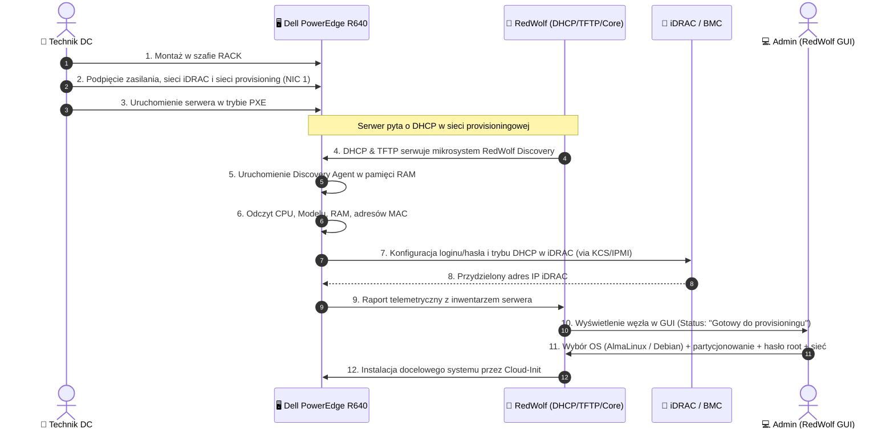

<p align="center">
  
</p>

<p align="center">
  <strong>Nowoczesny, otwarty system automatycznego provisioningu serwerów Bare Metal i maszyn wirtualnych</strong>
</p>

<p align="center">
  
  
  
  
</p>

---

## 🐺 O projekcie RedWolf

**RedWolf** to narzędzie open source stworzone z myślą o inżynierach data center, administratorach systemowych i DevOps. Jego celem jest zminimalizowanie czasu i manualnej pracy potrzebnej do uruchomienia nowo dostarczonego serwera fizycznego w szafie serwerowej (ang. *rack & roll*) oraz maszyn wirtualnych.

Platformą referencyjną i pierwszym celem wdrożeniowym projektu jest **Dell PowerEdge R640**, z zachowaniem pełnej elastyczności dla pozostałych platform serwerowych x86_64 oraz środowisk wirtualnych (KVM, Proxmox, VMware).

---

## ⚡ Scenariusz Działania (Workflow Technika)

Tradycyjny provisioning wymaga ręcznego logowania się do konsoli monitora serwera, konfigurowania BIOS/iDRAC, podpinania pendrive'ów lub ręcznego ustawiania adresów IP. **RedWolf eliminuje wszystkie te kroki:**



### Krok po kroku:

1. **Podłączenie fizyczne serwera:**
   Technik instaluje serwer (np. Dell PowerEdge R640) w szafie i podłącza dokładnie 3 kable:
   - **a) Zasilanie** (redundantne zasilacze PSU1/PSU2)
   - **b) Sieć iDRAC / BMC** (dedykowany port zarządzania out-of-band)
   - **c) Sieć provisioningową** (pierwszy port karty sieciowej: NIC 1 / eth0 / LOM1)

2. **Start PXE:**
   Technik włącza zasilanie. Serwer uruchamia się przez sieć (PXE Boot).

3. **Przejęcie przez RedWolf (Auto-Discovery):**
   - RedWolf automatycznie zarządza usługami **DHCP** i **TFTP** w odizolowanej sieci provisioningowej.
   - Po starcie PXE serwer ładuje przez sieć lekki obraz in-memory (**RedWolf Discovery Agent**).
   - Agent automatycznie i bez ingerencji człowieka wykonuje:
     - **Inwentaryzację podzespołów:**
       - Model i architektura procesora (CPU)
       - Model platformy/obudowy (np. `Dell Inc. PowerEdge R640`)
       - Całkowita ilość pamięci RAM i obsadzenie slotów DIMM
       - Adresy MAC wszystkich zainstalowanych kart sieciowych
     - **Automatyzację iDRAC / BMC:**
       - Ustawienie zdefiniowanego przez administratora bezpiecznego loginu i hasła do BMC
       - Włączenie trybu DHCP na interfejsie sieciowym BMC
       - Odczytanie uzyskanego przez BMC adresu IP

4. **Prezentacja w GUI RedWolf:**
   - Wszystkie zebrane dane telemetryczne trafiają w czasie rzeczywistym do panelu webowego RedWolf.
   - Węzeł zmienia status na **"Gotowy do provisioningu"** (*Ready for Provisioning*).

5. **Wdrożenie Systemu Operacyjnego przez Cloud-Init:**
   Z poziomu interfejsu graficznego RedWolf administrator wybiera docelowy system i parametry:
   - **Dystrybucje systemowe:**
     - **AlmaLinux:** wersje `8`, `9`, `10`
     - **Debian:** wersje `12 (Bookworm)`, `13 (Trixie)`
   - **Konfiguracja wdrożenia:**
     - **Partycjonowanie dysków:** schemat automatyczny (LVM, RAID 1/5/10, dyski SSD/NVMe/HDD, SWAP, montowania)
     - **Konta i dostęp:** hasło użytkownika `root`, wstrzyknięcie kluczy publicznych SSH
     - **Konfiguracja sieciowa serwera:** docelowy adres IP (statyczny / DHCP), brama, serwery DNS, bonding (LACP 802.3ad) lub podział na VLAN-y

---

## 📁 Struktura Repozytorium

```text
RedWolf/
├── AGENTS.md                  # Wytyczne i kontekst dla sztucznej inteligencji (AI rules)
├── GEMINI.md                  # Dowiązanie do wytycznych agentów AI
├── README.md                  # Główny opis projektu (ten plik)
├── .agents/
│   └── rules/
│       └── redwolf-domain.md  # Reguły domenowe dla asystentów AI
├── assets/
│   └── logo/                  # Wektorowe i rastrowe logo RedWolf
│       ├── redwolf-horizontal.svg       # Główne logo poziome (jasne)
│       ├── redwolf-horizontal-dark.svg  # Logo poziome do ciemnego GUI
│       ├── redwolf-icon.svg             # Samodzielna sygnatura / ikona
│       ├── redwolf-logo.svg             # Pełne logo pionowe
│       ├── redwolf-logo-dark.svg        # Pełne logo pionowe ciemne
│       ├── favicon.ico / favicon.png    # Ikony przeglądarkowe
│       ├── index.html                   # Interaktywny podgląd logotypów
│       └── *.png                        # Wersje rastrowe (32px, 64px, 128px, 256px, 512px, 1024px)
├── docs/
│   ├── ARCHITECTURE.md        # Szczegółowa architektura systemu
│   └── SPECIFICATION.md       # Kompletna specyfikacja techniczna
```

---

## 🎨 Zasoby Wizualne i Logo

Logo projektu RedWolf zostało przygotowane w formacie wektorowym SVG oraz rastrowym PNG z przezroczystym tłem:

| Format / Wariant | Podgląd | Przeznaczenie |
| :--- | :--- | :--- |
| **Ikona / Emblem** (`assets/logo/redwolf-icon.svg`) | Wilcza głowa z przyciskiem Power i ścieżką PCB | Favicon, awatary, zwinięty pasek boczny |
| **Poziome Jasne** (`assets/logo/redwolf-horizontal.svg`) | Sygnatura + napis RedWolf + Open Source Provisioning | Nagłówki dokumentacji, jasny interfejs |
| **Poziome Ciemne** (`assets/logo/redwolf-horizontal-dark.svg`) | Wariant z jasną typografią `#F8FAFC` | Główny pasek nawigacyjny ciemnego GUI |
| **Pionowe Stacked** (`assets/logo/redwolf-logo.svg`) | Duży układ pionowy | Splash screen, ekrany logowania, dialogi |

Podgląd wszystkich wariantów w przeglądarce dostępny jest w pliku [assets/logo/index.html](file:///home/dawid/RedWolf/assets/logo/index.html).

---

## 🚀 Plan Rozwoju (Roadmap)

- [x] Opracowanie założeń architektonicznych i specyfikacji wdrożenia.
- [x] Wektoryzacja, oczyszczenie i standaryzacja logo (SVG, PNG, dark/light theme).
- [x] Przygotowanie instrukcji dla agentów AI (`AGENTS.md`, `.agents/rules/`).
- [ ] Implementacja demona sieciowego DHCP/TFTP zintegrowanego z RedWolf Core.
- [ ] Przygotowanie minimalnego obrazu bootowalnego `redwolf-discovery` (initramfs + busybox/alpine + ipmitool).
- [ ] Implementacja panelu GUI (Web Dashboard: inwentaryzacja, status maszyn, kreator instalacji).
- [ ] Generator szablonów Cloud-Init dla AlmaLinux 8/9/10 i Debian 12/13.
- [ ] Testy integracyjne na platformie Dell PowerEdge R640.

---

## 📄 Licencja

Projekt rozwijany jako oprogramowanie open source.
Szczegóły licencji zostaną opublikowane wraz z pierwszym wydaniem kodu źródłowego.
