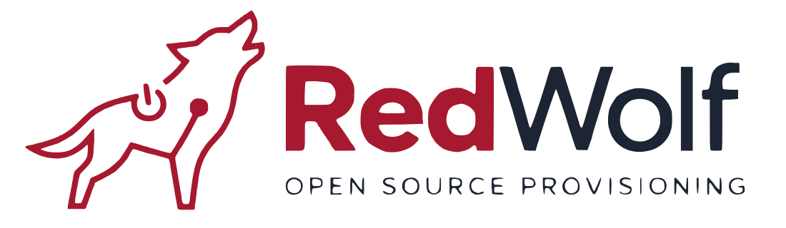
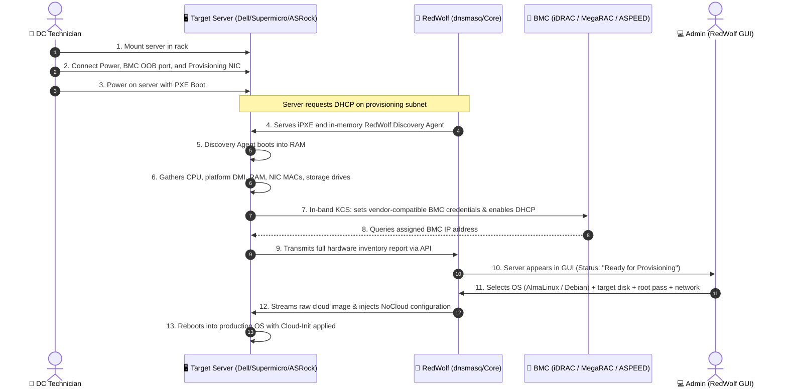

<p align="center">
  
</p>

<p align="center">
  <strong>Modern, open-source automated provisioning platform for Bare Metal servers (Dell, Supermicro, ASRock Rack) and Virtual Machines</strong>
</p>

<p align="center">
  
  <a href="https://hub.docker.com/r/wolverandover/redwolf"></a>
  
  
  
  
</p>

---

## 🐺 About RedWolf

**RedWolf** is an open-source bare-metal and virtual machine automation system built for data center infrastructure engineers, sysadmins, and DevOps teams. Its purpose is to streamline server installation, turning bare hardware racking into a zero-touch, hands-off provisioning process.

RedWolf features a built-in **Hardware Abstraction Layer (HAL)** supporting major enterprise hardware platforms:
* **Dell PowerEdge:** 13th, 14th, 15th, and 16th Gen (R640, R740, R750 with iDRAC 8/9).
* **Supermicro:** Intel and AMD platforms (X10, X11, X12, H11, H12 with AMI MegaRAC BMC).
* **ASRock Rack:** Server motherboards (EPYCD8, ROMED8, B650D4 series with ASPEED AST2500/2600 BMC).
* **Virtualization & Generic x86_64:** Standard IPMI 2.0 / Redfish servers and VMs (KVM, Proxmox, VMware ESXi).

---

## ⚡ Technician Deployment Workflow

Traditional provisioning requires connecting local crash carts/monitors, manually configuring BIOS and BMC settings, flashing USB media, or manually assigning static IPs. **RedWolf eliminates all manual setup:**



---

## 📖 Step-by-Step Operator Guide

Follow these steps to deploy the RedWolf appliance, configure networking and operating system images, discover physical hardware, and provision servers with enterprise storage layouts.

---

### Step 1: Deploy the RedWolf Appliance (Zero-Build)

RedWolf is published as an official, pre-built production container on Docker Hub ([`wolverandover/redwolf`](https://hub.docker.com/r/wolverandover/redwolf)). The official image includes the compiled React 19 dashboard, Go backend engine, and **pre-packaged Alpine discovery boot assets** (`initramfs.img` and `vmlinuz`), requiring **no local compilation**.

RedWolf requires `network_mode: host` (or Macvlan) to observe Layer-2 DHCP discovery broadcasts on the provisioning network interface.

#### Method A: Docker Compose (Recommended)
```bash
# 1. Clone the repository
git clone https://github.com/TensorDriftStudio/RedWolf.git
cd RedWolf

# 2. Pull official pre-built image from Docker Hub
docker compose pull

# 3. Start the RedWolf appliance container
docker compose up -d

# 4. Verify service health and active version
docker compose ps
curl -s http://localhost:8080/healthz
curl -s http://localhost:8080/api/version
```

#### Method B: Standalone Docker Run
To run the appliance directly without cloning the repository:
```bash
# Pull official release image
docker pull wolverandover/redwolf:latest

# Create persistent storage directories
mkdir -p data/db data/images data/tftp

# Launch container with host networking and net capabilities
docker run -d \
  --name redwolf-core \
  --restart unless-stopped \
  --network host \
  --cap-add NET_ADMIN \
  --cap-add NET_BIND_SERVICE \
  --cap-add NET_RAW \
  -e REDWOLF_HTTP_PORT=8080 \
  -e REDWOLF_PROVISIONING_INTERFACE=eth0 \
  -e REDWOLF_DB_PATH=/var/lib/redwolf/db/redwolf.db \
  -e REDWOLF_IMAGE_DIR=/var/lib/redwolf/images \
  -e REDWOLF_TFTP_DIR=/var/lib/redwolf/tftp \
  -v $(pwd)/data/db:/var/lib/redwolf/db \
  -v $(pwd)/data/images:/var/lib/redwolf/images \
  -v $(pwd)/data/tftp:/var/lib/redwolf/tftp \
  wolverandover/redwolf:latest
```

> [!TIP]
> **Discovery Boot Assets Automation:**
> The discovery RAMdisk (`initramfs.img` ~215MB) and kernel (`vmlinuz` ~11MB) are already embedded inside the Docker image and synchronized to `/var/lib/redwolf/images/discovery/` on startup.
> For offline or air-gapped environments, you can manually fetch or update verified prebuilt assets at any time via:
> ```bash
> ./scripts/download-discovery.sh
> ```

> [!NOTE]
> For isolated secondary provisioning interfaces (e.g. `eth1`), use the Macvlan compose profile:
> `docker compose -f docker-compose.macvlan.yml up -d`
> 
> For active frontend UI development with hot-reload (HMR):
> `docker compose -f docker-compose.dev.yml up --build` (Web UI at `http://localhost:5173`)

---

### Step 2: Sign In & Authentication Configuration

Open your web browser and navigate to:
```text
http://<APPLIANCE_IP>:8080
```

1. **Select Identity Provider:**
   - **Local Admin:** Built-in appliance administrator credentials.
   - **OpenLDAP / FreeIPA:** Authenticates against corporate RFC 4511 directory services.
   - **Active Directory:** Authenticates against Windows AD DS using LDAPS (port 636).
2. Click **Sign In to RedWolf GUI** to enter the Fleet Management dashboard.

---

### Step 3: Configure Network Subnet & DHCP Engine

Before booting bare-metal servers, verify your provisioning network configuration:

1. Click the **Settings** icon in the top navigation bar.
2. Select the **PXE Engine & Network** tab:
   - **Provisioning Interface:** Select your physical provisioning NIC (e.g. `eth0` or `enp3s0`).
   - **Subnet CIDR:** Enter your rack subnet (e.g. `192.168.10.0/24`).
   - **DHCP Pool Range:** Set the discovery address allocation range (e.g. `192.168.10.100` – `192.168.10.200`).
   - **Gateway & DNS:** Specify default router and upstream nameservers (e.g. `1.1.1.1, 8.8.8.8`).
3. Click **Save Configuration**. The internal `dnsmasq` service dynamically reloads its configuration with zero downtime.

---

### Step 4: Download & Pre-Cache Operating System Images

RedWolf provisions bare-metal servers using official cloud raw images (`.raw.zstd`). Images must be downloaded before deployment (non-cached images are locked in the Provisioning Wizard to prevent deployment failures).

#### Method A: Download via Web Dashboard (One-Click)
1. In **Settings**, navigate to the **Operating System Images** tab.
2. Choose your desired target distribution:
   - **AlmaLinux 10 LTS** (Next-Gen Enterprise LTS)
   - **AlmaLinux 9 LTS** (Enterprise LTS)
   - **Debian 13 (Trixie) LTS** (Next-Gen Debian LTS)
   - **Debian 12 (Bookworm) LTS** (Enterprise LTS)
   - **Ubuntu 24.04 LTS / 22.04 LTS**
3. Click **Download Image**. RedWolf streams the official raw image asynchronously, decompresses and prepares sparse transfer blocks, and verifies SHA256 checksums with real-time UI progress bars.

#### Method B: Download via CLI
```bash
# Download specific distributions:
./scripts/download-images.sh almalinux-10 debian-13

# Or download all supported systems at once:
./scripts/download-images.sh all
```

---

### Step 5: Hardware Racking & Zero-Touch Discovery

1. **Physical Cabling:**
   - Connect **Power** to the server redundant power supplies.
   - Connect the server's **Dedicated BMC RJ-45 Port** to your out-of-band management switch.
   - Connect the primary **Provisioning NIC (Port 1)** to the RedWolf Layer-2 provisioning VLAN/switch.
2. **Power On & Network Boot:**
   - Power on the server. Ensure UEFI/BIOS boot priority is set to **Network (PXE)**.
3. **Automated Discovery Flow:**
   - RedWolf DHCP hands out an IP and chains to `ipxe.efi`.
   - The server boots the lightweight Alpine Linux discovery agent (`redwolf-discovery`) into RAM.
   - The agent reads chassis DMI (Dell Service Tag, Supermicro / ASRock serial), enumerates all CPUs, RAM DIMMs, network interfaces, and storage drives.
   - The agent interfaces with the onboard BMC via in-band KCS (`/dev/ipmi0`), sets the management interface to **Dedicated** port mode, requests DHCP, and escrows credentials into RedWolf's encrypted AES-256-GCM vault.
4. **Appears in Fleet Dashboard:**
   - In 60–90 seconds, the node appears on the dashboard with status **"Ready for Provisioning"**.

---

### Step 6: Provision Operating System & Storage Layouts

Click **Provision OS** on any discovered server to open the multi-step deployment wizard:

#### 1. Operating System Selection
- Select an active, downloaded operating system (e.g. *AlmaLinux 10* or *Debian 13*).

#### 2. Storage Layout Engine Selection
Choose between three deterministic storage architectures:

* **Option A: Standard Partitioning (Auto-Expanding)**
  - Streams the official cloud image directly to the selected disk.
  - Automatically invokes `parted resizepart` and `partprobe` to extend the root partition to 100% of the drive capacity.
  - Mounts root in RAM and triggers online filesystem expansion (`xfs_growfs` for XFS on AlmaLinux, `resize2fs` for ext4 on Debian).

* **Option B: Logical Volume Manager (LVM)**
  - Configures standard GPT layout: 512MB EFI System Partition (`ESP`), 1024MB `/boot`, and LVM Physical Volume (`8e00`).
  - Creates Volume Group `vg_system` with Logical Volumes:
    - `lv_root` (`/`)
    - `lv_var` (`/var`)
    - `lv_home` (`/home`)
    - `lv_tmp` (`/tmp`)
    - `lv_swap` (`swap`)
  - **Capacity Allocator & Auto-Fit:** Use the interactive drive capacity bar to customize sizes, or click **"Auto-fit to Drive"** to proportionally scale all partitions to match the exact size of your drive without over-allocation.

* **Option C: Software RAID (`mdadm`)**
  - Select 2 or more storage drives (NVMe SSDs, SAS, or SATA drives).
  - Select RAID level: **RAID 0** (Striping), **RAID 1** (Mirroring), **RAID 5** (Distributed Parity), or **RAID 10** (Striped Mirrors).
  - Formats redundant FAT32 ESPs on all member drives and synchronizes dual `mdadm.conf` paths for both RHEL/AlmaLinux (`/etc/mdadm.conf`) and Debian/Ubuntu (`/etc/mdadm/mdadm.conf`).
  - Registers redundant UEFI boot entries so the server boots seamlessly even if Drive 0 fails.

#### 3. Target Drive Selection
- Select target drive(s) from the detected hardware inventory (e.g. `Dell BOSS RAID1`, `Samsung PM9A3 NVMe`, `Supermicro SATADOM`).
- Drives are bound by immutable identifiers (`/dev/disk/by-id/...`), eliminating blind `/dev/sda` drive corruption.

#### 4. Cloud-Init Credentials & Network Configuration
- Set server hostname, admin user, root password, and SSH public keys.
- Network Mode:
  - **DHCP:** Standard automatic assignment.
  - **Static IP:** IP address, netmask, gateway, and DNS servers (automatically bound to the physical network card MAC address via Cloud-Init `match: macaddress: "..."`).

#### 5. Automated Deployment
- Click **Start Deployment**.
- RedWolf streams the OS image, applies the chosen partition/LVM/RAID configuration, injects the NoCloud Cloud-Init seed (`/var/lib/cloud/seed/nocloud/`), sets disk boot priority via `efibootmgr`, and reboots directly into the production OS.

---

### Step 7: Post-Deployment Management & BMC Control

Click on any server in the Fleet view to open the **Hardware Telemetry & Control Drawer**:

* **Out-of-Band BMC Console:**
  - View the assigned BMC IP address.
  - Click **Open Console** to launch the vendor web GUI (Dell iDRAC, Supermicro IPMI/MegaRAC, ASRock Rack ASPEED).
  - Reveal or rotate escrowed BMC passwords on demand.
  - Perform out-of-band power operations (**Power On**, **Power Off**, **Power Cycle**, **Graceful Shutdown**).
* **Reset Node State:**
  - Click **Reset State** to re-trigger discovery or clear a completed deployment.
* **Decommission Node:**
  - Click **Decommission** to remove obsolete hardware records from the database.

---

### Step 8: Updating an Existing RedWolf Server

To update an active RedWolf installation to the latest version with zero manual compilation:

```bash
cd /path/to/RedWolf

# 1. Pull the latest code and configuration from GitHub
git pull origin main

# 2. Pull the latest prebuilt appliance image from Docker Hub
docker compose pull

# 3. Restart RedWolf with the updated engine
docker compose up -d
```
All persistent databases (`data/db`), OS images (`data/images`), and network configurations remain completely preserved.

---

### Step 9: Testing Without Physical Hardware (Node Simulator)

Test the complete RedWolf discovery and provisioning pipeline without physical bare-metal hardware:

```bash
# Simulate a Dell PowerEdge R640 node sending live hardware telemetry:
bash scripts/simulate-node.sh --vendor dell --count 1

# Simulate Supermicro or ASRock Rack servers:
bash scripts/simulate-node.sh --vendor supermicro --count 1
bash scripts/simulate-node.sh --vendor asrock --count 1

# Launch an actual QEMU virtual machine booting the real discovery RAMdisk:
bash scripts/simulate-node.sh --mode qemu --vendor dell
```

---

## 🐳 Docker Deployment Details

Official pre-built production appliance images are published to Docker Hub:
* **Repository:** [`wolverandover/redwolf`](https://hub.docker.com/r/wolverandover/redwolf)
* **Tags:**
  * `wolverandover/redwolf:latest` — Tracks the latest stable release
  * `wolverandover/redwolf:1.3.6` — Immutable release version

The production appliance container packages all dependencies into a lightweight, secure Alpine image:

```bash
# Pull official image from Docker Hub
docker pull wolverandover/redwolf:latest

# Start the appliance using Docker Compose
docker compose up -d

# View live container logs
docker compose logs -f redwolf
```

### Environment Variables

| Variable | Default | Description |
| :--- | :--- | :--- |
| `REDWOLF_HTTP_PORT` | `8080` | Port for Web GUI and REST API |
| `REDWOLF_PROVISIONING_INTERFACE` | `eth0` | Network interface for DHCP/TFTP broadcasts |
| `REDWOLF_DB_PATH` | `/var/lib/redwolf/db/redwolf.db` | Path to persistent SQLite WAL database |
| `REDWOLF_IMAGE_DIR` | `/var/lib/redwolf/images` | Storage cache directory for OS images |
| `REDWOLF_TFTP_DIR` | `/var/lib/redwolf/tftp` | TFTP root serving iPXE bootloaders |

---

## 🛠️ Tooling & Scripts Reference

### 1. Build Discovery Boot Assets (Kernel & Initramfs)
To build or update the Alpine Linux in-memory discovery environment:
```bash
bash scripts/build-discovery-ramfs.sh
```
Outputs `assets/discovery/vmlinuz` and `assets/discovery/initramfs.img` with bundled hardware drivers (`ixgbe`, `i40e`, `bnxt_en`, `tg3`, `mlx5_core`, `megaraid_sas`, `mpt3sas`, `smartpqi`, `nvme`), GNU `util-linux`, `ipmitool`, and the static Go `redwolf-discovery` binary.

### 2. Cloud OS Image Manager
To inspect, download, or verify OS distributions via CLI:
```bash
# Check download cache status
bash scripts/download-images.sh --check

# Download specific distribution
bash scripts/download-images.sh --os almalinux9
bash scripts/download-images.sh --os debian12

# Download all supported distributions
bash scripts/download-images.sh --all
```

---

## 📁 Repository Layout

```text
RedWolf/
├── AGENTS.md                  # Mandatory AI context & engineering guidelines (English only)
├── README.md                  # Main project documentation (this file)
├── CHANGELOG.md               # Keep a Changelog semantic release history
├── VERSION                    # SemVer release tag (1.2.0)
├── Dockerfile                 # Multi-stage production container build (Web UI + Go Core + Assets)
├── docker-compose.yml         # Host-networking appliance deployment
├── docker-compose.macvlan.yml # Isolated physical interface Macvlan deployment
├── docker-compose.dev.yml     # Live frontend development environment with Vite HMR
├── cmd/
│   ├── redwolf/               # RedWolf Core server daemon entrypoint
│   └── redwolf-discovery/     # In-memory bare-metal discovery agent entrypoint
├── internal/
│   ├── domain/                # Pure domain models (ServerNode, Hardware, Credentials, FSM)
│   ├── service/               # Orchestration services (Provisioner, Auth, Settings, BMC Escrow, ImageCatalog)
│   ├── adapter/               # Infrastructure adapters (HTTP/Chi, SQLite WAL, dnsmasq, LDAP/AD, AES-256)
│   ├── agent/                 # Discovery agent collectors (CPU, DMI, Memory, Network, Storage, BMC)
│   └── version/               # Enterprise version and build metadata
├── scripts/
│   ├── build-discovery-ramfs.sh # Automated Alpine discovery kernel & ramdisk packager
│   ├── init.sh                # In-memory discovery system init (PID 1) script
│   ├── simulate-node.sh       # Multi-vendor hardware simulator & QEMU test rig
│   ├── download-images.sh     # Cloud raw image mirror and verification utility
│   └── Dockerfile.discovery   # Clean containerized build environment for PXE boot artifacts
├── assets/
│   ├── discovery/             # Network bootable vmlinuz kernel & initramfs
│   ├── tftp/                  # Production iPXE bootloaders (ipxe.efi, undionly.kpxe)
│   └── logo/                  # Vector SVG and high-resolution PNG brand assets
├── web/                       # React 19 + TypeScript + Vite + TailwindCSS Enterprise Dashboard
└── docs/                      # Architectural specifications and operational guides
```

---

## 🎨 Visual Assets & Branding

Lossless vector SVGs and transparent PNGs are available in [`assets/logo/`](file:///home/dawid/RedWolf/assets/logo/):
* **Horizontal Dark Logo:** [`assets/logo/redwolf-horizontal-dark.svg`](file:///home/dawid/RedWolf/assets/logo/redwolf-horizontal-dark.svg) (for Web GUI navbar).
* **Icon / Emblem:** [`assets/logo/redwolf-icon.svg`](file:///home/dawid/RedWolf/assets/logo/redwolf-icon.svg) (favicon, avatars, collapsed sidebar).
* **Interactive Showcase:** View [`assets/logo/index.html`](file:///home/dawid/RedWolf/assets/logo/index.html).

---

## 🚀 Roadmap

### ✅ Version 1.0.0 — Baseline MVP (Completed)
- [x] Initial multi-vendor HAL architecture for Dell PowerEdge, Supermicro, and ASRock Rack.
- [x] In-memory Alpine Linux discovery agent (`redwolf-discovery`) with kernel drivers.
- [x] iPXE/TFTP bootloader chaining with dynamic `/boot.ipxe` script generation.
- [x] SQLite WAL database storage engine with concurrency protection.
- [x] Core React 19 + TypeScript + TailwindCSS operator console.
- [x] Multi-directory identity provider support (Local Admin, OpenLDAP, Active Directory).
- [x] Hardware telemetry ingestion for CPUs, memory DIMMs, network interfaces, and storage drives.

### ✅ Version 1.3.6 — Enterprise Bare-Metal Hardening & Hardware Bulletproofing (Current)
- [x] **Fail-Fast Initramfs & Chroot Networking:** Added fail-fast error reporting if `dracut` or `update-initramfs` fails, chroot DNS resolution via `/etc/resolv.conf`, and automatic `mdadm` installation in Debian/Ubuntu chroot on Software RAID.
- [x] **Strict Cloud-Init YAML Validation:** Pre-flight YAML schema parser for custom user-data and network configs with domain sentinel errors (`ErrInvalidYAMLConfig`, `ErrInsufficientStorage`, `ErrBootloaderFailed`).
- [x] **Target Firmware Mode Invariants:** Explicit `FirmwareMode` (`uefi`, `bios`, `auto`) in deployment config, BIOS MBR failure detection, and unique NVRAM labels per RAID member disk.
- [x] **Deterministic LVM & Partition Settlement:** Enforced fixed-size LVs created before dynamic `+100%FREE`, eliminated arbitrary scaling down, consolidated partition settling into `settlePartitions`, and added `udevadm settle` polling.
- [x] **Extended Attributes Preservation:** Root filesystem image extraction using `cp -a --preserve=all` to protect SELinux contexts and capabilities.

### ✅ Version 1.3.5 — Custom Cloud-Init & Storage Architecture Bulletproofing
- [x] **Custom Cloud-Init YAML Preservation:** Intelligent top-level YAML key inspection preventing duplicate key overwrites, native LACP 802.3ad bonding (`bond0`) and 802.1Q VLAN tagging (`vlan<ID>`) generation in Netplan v2.
- [x] **Custom Network Config Support:** Added `CustomNetworkConfig` in `domain.DeploymentConfig` for fully customizable network topologies.
- [x] **Storage & RAID Hardening:** Megabyte free capacity querying in LVM `vgs`, pre-wiping existing disk signatures with `wipefs -a -f`, and dynamic kernel arguments for custom LV names.

### ✅ Version 1.3.4 — Embedded Asset Sync & Plymouth Suppression
- [x] **Deterministic Embedded Asset Sync:** Updated `entrypoint.sh` to copy dotfiles and `.version` from `/usr/share/redwolf/assets/discovery/.` into persistent storage, ensuring newly built discovery RAMdisks are never skipped due to missing GitHub Releases downloads.
- [x] **Plymouth Display Suppression (`plymouth.enable=0`):** Injected `plymouth.enable=0` into target kernel cmdline to prevent Plymouth splash from seizing the console or hiding live boot output on VMware/KVM screens.

### ✅ Version 1.3.3 — Universal VGA Console & Unrestricted Dracut Boot
- [x] **Unrestricted Storage Auto-Assembly:** Replaced restrictive UUID and LV filters with universal `rd.auto=1 rd.lvm=1 rd.md=1`, allowing dracut to cleanly discover and assemble all local Software RAID and LVM partitions.
- [x] **Live Systemd Status Reporting:** Injected `systemd.show_status=1` into kernel cmdline for real-time visibility into systemd service execution and dracut startup jobs.
- [x] **Pre-loaded RAID & DM Kernel Drivers in Initramfs:** Explicitly instructed dracut to bake `raid1` and `dm_mod` directly into `/boot/initramfs-*.img`.

### ✅ Version 1.3.2 — Primary Console Ordering & Dynamic LVM Detection
- [x] **Dynamic LVM Device Detection:** Purged stale cloud image `/etc/lvm/devices/system.devices` and configured `use_devicesfile = 0` in `lvmlocal.conf` and `lvm.conf` so dracut dynamically scans Software RAID and NVMe physical volumes.
- [x] **Universal MDADM `--homehost=any`:** Created Software RAID arrays with `--homehost=any` to avoid foreign host locking on target systems.
- [x] **Target Initramfs Regeneration:** Native chroot regeneration using dracut (`--force --no-hostonly --add "mdraid lvm"`) and `update-initramfs` to guarantee storage and RAID modules are pre-baked into the target OS boot image.
- [x] **Explicit Dracut Kernel Arguments:** Injected `rd.auto=1`, `rd.lvm=1`, `rd.lvm.vg=vg_system`, `rd.lvm.lv=vg_system/root`, `rd.md=1`, and explicit `rd.md.uuid` parameters into GRUB and BLS entries.

### ✅ Version 1.3.1 — Universal GRUB Engine & Clean Storage Shutdown
- [x] **Universal GRUB Engine:** Generates standalone, bulletproof `grub.cfg` files with direct kernel `menuentry` definitions across `/boot/grub/grub.cfg`, `/boot/grub2/grub.cfg`, and root of `/boot`, eliminating fallback to `grub>` command prompt.
- [x] **Clean Storage & RAID Shutdown:** Implemented `CleanShutdownStorage` to synchronize all page cache buffers, deactivate LVM volume groups, await `/boot` RAID1 mirror sync, and cleanly stop or protect md arrays prior to reboot (preventing `md: resync interrupted`).
- [x] **Syntax-Safe EFI Stubs:** Repaired UEFI stub loader script in `/boot/efi/EFI/*/grub.cfg` with native GRUB commands without unsupported bash test operators.
- [x] **Preloaded GRUB Drivers:** Embedded essential storage drivers (`part_gpt`, `part_msdos`, `ext2`, `xfs`, `mdraid1x`, `lvm`, `biosdisk`) directly into `core.img`.

### ✅ Version 1.3.0 — Universal Dual BIOS & UEFI Hybrid Storage Architecture
- [x] **4-Partition Hybrid GPT Layout:** Standardized 4-partition GPT layout (BIOS Boot `ef02` + ESP `ef00` + ext4 `/boot` + Data/LVM) on Software RAID 1 and LVM targets.
- [x] **Legacy BIOS MBR Installation:** Integrated native `grub-bios` (`i386-pc`) MBR installation on all target disks for seamless boot on Legacy BIOS motherboards and hypervisors.
- [x] **Firmware-Aware UI Scheme:** Dynamically adapts partition presets in `ProvisioningWizard` to show `Standard (BIOS MBR + Root)` for BIOS nodes and `Standard (EFI + Root)` for UEFI nodes.
- [x] **Universal ext4 Boot Filesystem:** Formatted `/boot` RAID 1 with `ext4` and metadata 1.0, ensuring native readability by all BIOS and UEFI GRUB stages.

### ✅ Version 1.2.9 — UEFI Bootloader UUID & Fallback Resilience
- [x] **UEFI Stub Search UUID Repair:** Repaired `/boot/efi/EFI/*/grub.cfg` to point `--fs-uuid` to the target `/boot` filesystem UUID (`/dev/md0` or dedicated `/boot`).
- [x] **Fallback Bootloader Sync:** Synchronized `/EFI/BOOT/BOOTX64.EFI`, `grubx64.efi`, and `grub.cfg` across all ESP mirrors for hypervisors bypassing NVRAM.
- [x] **Deterministic ESP Partition Detection:** Ensured `detectEFIPartition` correctly targets partition 1 on real drives, with Legacy BIOS detection warning.
- [x] **Protective MBR Boot Flag:** Enabled PMBR active boot flags (`pmbr_boot on` and `sgdisk -A 1:set:2`) for firmware sector 0 validation.

### ✅ Version 1.2.8 — Storage Extraction & Loop Container Stream Resilience
- [x] **File Container Streaming:** Added support for streaming OS raw images directly to disk container files (`O_CREATE | O_TRUNC`) with parent directory creation.
- [x] **Adaptive Temp Location:** Intelligent selection between in-memory RAM (`/tmp`) and target volume based on free space to avoid memory pressure.
- [x] **Deterministic Resource Lifecycle:** Guaranteed immediate detachment of loop devices and deletion of raw image files right after filesystem synchronization.
- [x] **Partition Settle Guards:** Added `settlePartitions` and `waitForDevice` synchronization guards for loop partition nodes before mounting.

### ✅ Version 1.2.7 — Software RAID mdadm Syntax Fix Release
- [x] **mdadm CLI Flag Conformance:** Removed unsupported `--batch` option from `mdadm --create` commands, preventing `exit status 2: unrecognized option: batch`.
- [x] **Non-Interactive Array Assembly:** Preserved standard `--force` and `--run` flags for deterministic zero-touch Software RAID 1 array creation.

### ✅ Version 1.2.6 — GPT Partitioning Resilience & Asset Auto-Sync Release
- [x] **Alpine Discovery RAMdisk GPT Utilities:** Added missing standalone `sgdisk` package to discovery builder and appliance container.
- [x] **Defensive Partitioning Fallback:** Added automatic `parted` GPT fallback mechanism in `storage_layout.go` for multi-disk RAID and LVM.
- [x] **Automatic Asset Synchronization:** Enhanced `entrypoint.sh` to automatically detect version transitions and pull matching discovery RAMdisk assets.

### ✅ Version 1.2.5 — Software RAID, LVM Volume Architecture & Cloud-Init Resilience Release
- [x] **Multi-Disk Software RAID (`mdadm`):** Added RAID modules to initramfs, partition settling, and unified Software RAID + LVM layout.
- [x] **LVM Subvolume Mounts & Bootloader:** Fixed `/etc/fstab` `/dev/mapper` path generation and BLS/GRUB `rd.lvm.lv` kernel parameters.
- [x] **Cloud-Init Resilience:** Offline `/etc/redwolf-release` injection and dual NoCloud seed paths (`nocloud` & `nocloud-net`).

### ✅ Version 1.2.4 — Storage Autodetection & SELinux Relabeling Release
- [x] **Filesystem Autodetection & Mount Resilience:** Implemented `MountTargetFilesystem` with proactive filesystem driver probing and kernel module loading.
- [x] **SELinux First-Boot Relabeling:** Added `/.autorelabel` injection to guarantee password authentication on KVM/console for RHEL/AlmaLinux.
- [x] **UI Polish & Version Synchronization:** Cleaned up redundant interface indicators and synchronized frontend version with backend API.

### ✅ Version 1.2.1 — Patch & Multi-Tab Stability Release

### ✅ Version 1.2.0 — Enterprise Storage & Platform Release
- [x] **Full LVM Provisioning Engine:** Complete LVM Volume Group (`vg_system`) and Logical Volume allocation engine with dynamic disk-capacity auto-fit in the Web UI.
- [x] **Cross-Vendor Software RAID (`mdadm`):** Automated RAID 0, 1, 5, 10 array creation for AlmaLinux and Debian with dual `mdadm.conf` sync and redundant EFI bootloader replication.
- [x] **Dynamic Partition Auto-Expansion:** Deterministic GPT root partition boundary repair (`parted resizepart`, `partprobe`) with online filesystem growth (`xfs_growfs` / `resize2fs`).
- [x] **Modern LTS OS Catalog:** Added official **AlmaLinux 10** and **Debian 13 LTS** cloud raw images with direct automated download pipelines.
- [x] **Enterprise Discovery Asset Pipeline:** Prebuilt Alpine discovery RAMdisk release workflow (`initramfs.img`, `vmlinuz`) with automatic entrypoint download fallback.

### ✅ Version 1.1.0 — Enterprise Release
- [x] **Enterprise Semantic Versioning (SemVer):** Added `internal/version`, `GET /api/version` endpoint, Docker `-ldflags` injection, `VERSION`, and `CHANGELOG.md`.
- [x] **Branding & UI Standardization:** Unified application as **RedWolf GUI** with official vector logo and removed all temporary placeholder icons.
- [x] **Production Security Hardening:** Eliminated default credential hints and quick-fills from the login interface; added `ipmitool` package to production container.
- [x] **Dynamic Subnet & DNS Engine:** Integrated dynamic `dhcp-range`, `dhcp-boot`, and DNS option management in `dnsmasq` adapter with live subprocess reload on configuration changes.
- [x] **Automated OS Image Management:** Background cloud raw image downloader (`internal/service/image_catalog.go`) with live progress tracking in the Settings UI.
- [x] **Fleet Node Lifecycle Management:** Interactive node state reset (`POST /api/nodes/{id}/reset`) and decommission (`DELETE /api/nodes/{id}`).

### ⏳ Version 1.3.0 — Hardware Management & Observability (Next)
- [ ] **Redfish Out-of-Band Firmware Management:** Automated BIOS, iDRAC, and BMC firmware updates via DMTF Redfish API.
- [ ] **RAID Controller In-Band Configuration:** Automated hardware virtual disk array creation (RAID 0, 1, 5, 10) on Broadcom/LSI MegaRAID, Dell PERC, and Microsemi SmartRAID controllers via `storcli` / `perccli`.
- [ ] **Hardware Pre-Provisioning Stress Testing:** Automated RAM, CPU, and NVMe SMART endurance burn-in tests (`memtester`, `stress-ng`, `nvme-cli`) before marking nodes "Ready for Provisioning".
- [ ] **Remote OS Image Storage (S3 / MinIO):** Direct streaming of cloud images from enterprise object storage.
- [ ] **Role-Based Access Control (RBAC):** Granular permission scopes (Auditor, Operator, Infrastructure Admin) with audit logs.

### 🔮 Version 2.0.0 — Distributed Infrastructure (Long-Term)
- [ ] **Multi-Rack / Multi-Datacenter Relay Agents:** Lightweight Layer-2 proxy daemons for distributed provisioning across multiple enterprise racks and edge sites.
- [ ] **Terraform & OpenTofu Provider:** Infrastructure-as-Code provider to define and provision bare-metal nodes natively in Terraform.
- [ ] **High-Availability (HA) Core Clustering:** Raft-based consensus clustering for RedWolf Core appliances with active-passive DHCP failover.

---

## 📄 License

RedWolf is developed as open-source software under the Apache 2.0 / GPLv3 licenses.
